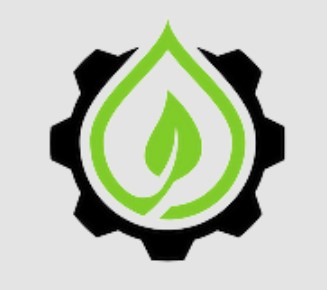

  

# EcoClear  
**Acolher é o primeiro passo para transformar**

## ✨ Objetivo  

A **EcoClear** é uma inovadora plataforma digital desenvolvida com o objetivo de monitorar empresas e suas emissões atmosféricas, com foco especial na liberação de gases tóxicos. Sua principal finalidade é acompanhar e registrar os poluentes emitidos por atividades industriais, oferecendo dados confiáveis e em tempo real.  

O propósito central da EcoClear é **contribuir para a redução da poluição ambiental** por meio do controle rigoroso das emissões. Ao identificar fontes de contaminação e promover maior transparência nas práticas corporativas, a plataforma estimula mudanças positivas nas rotinas produtivas.

## ❌ Problema  

A poluição industrial continua sendo uma das principais causas de degradação ambiental e de riscos à saúde da população. Um dos maiores desafios enfrentados atualmente é a **ausência de sistemas eficazes de monitoramento em tempo real** dentro das empresas, o que compromete o controle adequado das emissões de poluentes.

## 💻 Tecnologias Utilizadas  

- **Linguagens de Programação**  
  - JavaScript  
  - HTML  
  - CSS  

- **Sensores e Dispositivos**  
  - Sensores de Gás  
  - Sensores de Temperatura  
  - Dispositivos IoT para monitoramento em tempo real  

## 📝 Entregas  

- MER  
- DER  
- Diagrama de Classes  
- Dicionário de Dados  
- Documento de Requisitos  
- Banco de Dados Físico  
- Apresentação  
- Front-End Web  
- Front-End Mobile  
- Integração de telas:
  - Notícias  
  - Cadastro  
  - Login  
  - Perfil  
  - Monitoramento  
  - Contato  

## 🚀 Sprints  

### 🟢 Sprint 1  
- Tela de cadastro (Desktop)  
- Tela de login (Desktop)  
- Tela inicial  
- Sobre nós  
- Notícias  
- Contatos  
- Tela inicial (Mobile)  
- Home (Mobile)  
- Protótipo IoT  

### 🟡 Sprint 2  
- Monitoramento em tempo real (Desktop, Mobile e IoT)  
- Perfil (Desktop e Mobile)  
- Tela de login e cadastro (Mobile)  
- Administrador (Desktop)  
- Tela de relatórios (Mobile)  
- Gráficos (Mobile)  

### 🔵 Sprint de Integração  
- Integração das estruturas de banco de dados com o site (Desktop)  

### 🟣 Segundo Semestre  
- Integração das estruturas de banco de dados com o aplicativo (Mobile) e dispositivos IoT  

## 👩‍💻 Integrantes  

- **Ana Livia** — Banco de Dados  
- **Maria Fernanda** — Banco de Dados  
- **Fernanda** — Front-End  
- **Leticia** — Front-End  
- **Murilo** — Back-End  
- **Pedro** — Back-End  
- **Lorena** — Scrum Master, Full-Stack  
- **Sophia** — PO, Full-Stack  

## 🌱 Informações Adicionais  

Por meio da tecnologia e do monitoramento ambiental, a plataforma contribui para uma sociedade **mais justa, inclusiva e sustentável**, alinhando **inovação com responsabilidade social**.
